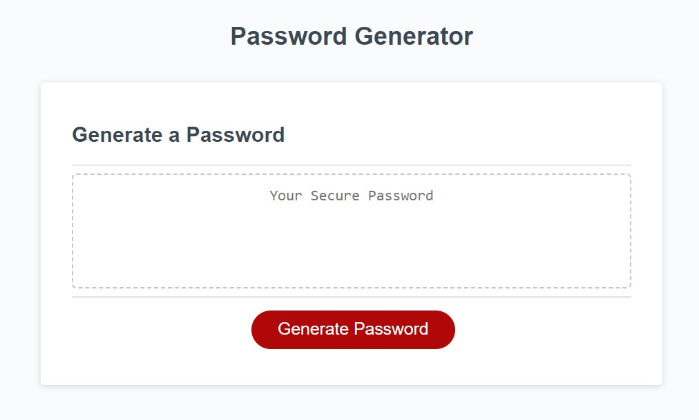

# 03-js-password

## Password Generator

With a provided code, this applications purpose will be to generate a password where the user is provided with several options for what level of security the password will contain.

The prompted choices will be:

- Special Characters
- Numbers
- Length (8-128 characters)
- Upper vs. Lowercase present

Following the prompts the password will either display in an alert or on the web application page.

[Password Generator](https://katievlasic.github.io/03-js-password/)

I was challenged by constraining what data types the user was able to enter. Creating if statements, using return, and defining a for loop to populate the password based on selections helped achieve success!
